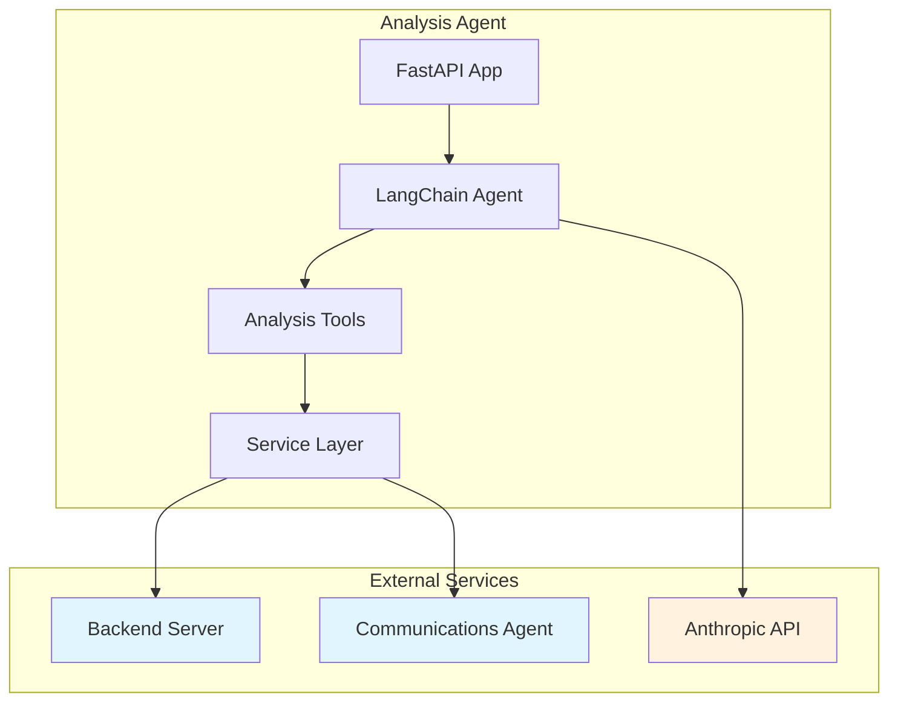
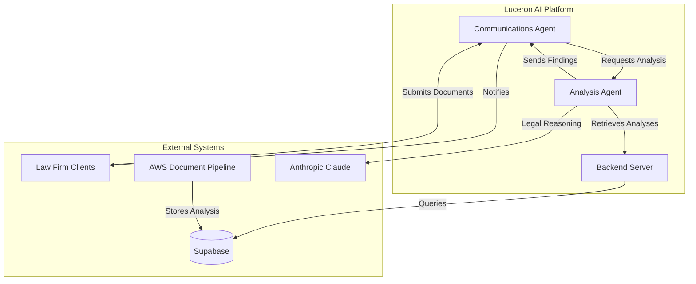
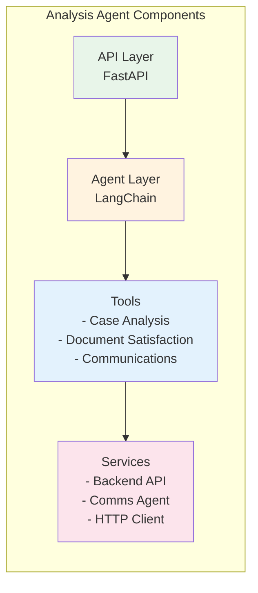

# Luceron AI Analysis Agent

## Component Overview

The Luceron AI Analysis Agent is a critical microservice in the Luceron AI eDiscovery platform, functioning as the senior legal partner in an automated family law financial discovery workflow. This component serves as the intelligent document review and evaluation system that synthesizes document analyses, identifies patterns, and provides strategic legal insights.

### Primary Purpose and Responsibilities

- **Senior Partner Analysis**: Reviews comprehensive document analyses prepared by AWS processing systems
- **Pattern Recognition**: Identifies cross-document patterns, inconsistencies, and financial red flags
- **Document Satisfaction Management**: Evaluates whether submitted documents satisfy legal requirements and marks them as completed
- **Strategic Legal Reasoning**: Provides senior-partner-level insights and recommendations based on complete case documentation
- **Communications Orchestration**: Triggers client communications through the Communications Agent when document issues are identified

### Position Within System Architecture

The Analysis Agent operates as the middle tier in a three-layer architecture:

1. **Backend Server** → Provides document analysis data from AWS processing
2. **Analysis Agent** (this component) → Performs senior-level review and reasoning
3. **Communications Agent** → Handles all client-facing communications based on analysis findings

### Key Business Problems Solved

- Automates senior legal partner review processes that traditionally require 3-5 hours per case
- Ensures consistent application of document satisfaction criteria across all cases
- Identifies financial discrepancies and hidden assets through pattern analysis
- Reduces manual document review workload by 70% in MVP, targeting 95-100% automation
- Provides audit trail of legal reasoning for compliance and quality assurance

## Technical Architecture

### Technology Stack

- **Runtime**: Python 3.13
- **Web Framework**: FastAPI (async)
- **HTTP Client**: httpx (async with 60s timeout)
- **AI/LLM**: 
  - LangChain (agent orchestration)
  - Anthropic Claude 3.5 Sonnet (model: claude-3-5-sonnet-20241022)
- **Data Validation**: Pydantic
- **Server**: Uvicorn (ASGI)
- **Container**: Docker (Python 3.13-slim base)

### Design Patterns and Architectural Decisions

1. **Agent-Based Architecture**: Uses LangChain agents with tool-calling capabilities for flexible reasoning workflows
2. **Tool Factory Pattern**: Centralized tool creation and management for consistent behavior
3. **Service Layer Pattern**: Separate service classes for external integrations (Backend API, Communications Agent)
4. **Async/Await Pattern**: Fully asynchronous request handling for scalability
5. **Streaming Response Pattern**: Server-Sent Events (SSE) for real-time analysis updates
6. **Callback Handler Pattern**: Workflow state persistence through LangChain callbacks

### System Dependencies and Integration Points



### Data Flow

1. **Analysis Request Flow**:
   - Request received via `/chat` or `/notify` endpoints
   - Workflow created in backend database
   - Agent retrieves all case document analyses
   - Agent performs reasoning and pattern recognition
   - Results stored in backend with reasoning chain
   - Final response streamed to client or stored for async processing

2. **Document Completion Flow**:
   - Agent retrieves requested documents and analyzed documents
   - Evaluates satisfaction based on criteria
   - Updates document status in backend
   - Triggers communications for document issues

## API Documentation

### Endpoints

#### POST `/chat`
Interactive chat interface for document analysis with real-time streaming responses.

**Request Schema**:
```json
{
  "message": "string",
  "case_id": "string"
}
```

**Response**: Server-Sent Events stream
```
data: {"type": "workflow_started", "workflow_id": "uuid"}
data: {"type": "final_response", "response": "analysis results"}
data: {"type": "workflow_complete", "workflow_id": "uuid"}
```

#### POST `/notify`
Fire-and-forget notification for background analysis work.

**Request Schema**:
```json
{
  "message": "string",
  "case_id": "string"
}
```

**Response**:
```json
{
  "status": "accepted",
  "workflow_id": "uuid",
  "message": "Analysis work scheduled"
}
```

#### GET `/`
Health check endpoint.

**Response**:
```json
{
  "status": "operational",
  "timestamp": "2024-01-01T00:00:00Z",
  "backend": "connected"
}
```

### Authentication

- **Backend API**: Bearer token authentication via `BACKEND_API_KEY` environment variable
- **Anthropic API**: API key authentication via `ANTHROPIC_API_KEY`

### Rate Limiting and Error Handling

- **Timeout**: 60-second timeout for all HTTP requests
- **LangChain Agent**: Maximum 20 iterations per analysis
- **Error States**: 
  - 503: Backend unavailable
  - 500: Analysis or workflow creation failures
  - Automatic workflow status updates to FAILED on errors

## Setup and Installation

### Prerequisites

- Python 3.13+
- Docker (for containerized deployment)
- Access to Anthropic API
- Access to Backend Server API
- Optional: Access to Communications Agent

### Environment Variables

```bash
# Required
ANTHROPIC_API_KEY          # Anthropic Claude API key
BACKEND_API_KEY            # Backend server authentication token
BACKEND_URL                # Backend server URL (e.g., https://api.luceron.ai)

# Optional
COMMUNICATIONS_AGENT_URL   # Communications agent URL for client messaging
PORT                       # Service port (default: 8080)
```

### Local Development Setup

1. Clone the repository:
```bash
git clone [repository-url]
cd luceron-ai-analysis-agent
```

2. Create virtual environment:
```bash
python -m venv venv
source venv/bin/activate  # On Windows: venv\Scripts\activate
```

3. Install dependencies:
```bash
pip install -r requirements.txt
```

4. Set environment variables:
```bash
export ANTHROPIC_API_KEY="your-key"
export BACKEND_API_KEY="your-backend-key"
export BACKEND_URL="http://localhost:8000"
```

5. Run the service:
```bash
python main.py
```

### Docker Configuration

Build and run with Docker:
```bash
# Build image
docker build -t luceron-analysis-agent .

# Run container
docker run -p 8080:8080 \
  -e ANTHROPIC_API_KEY="your-key" \
  -e BACKEND_API_KEY="your-backend-key" \
  -e BACKEND_URL="https://api.luceron.ai" \
  luceron-analysis-agent
```

## Configuration

### Configuration Files

1. **document_satisfaction_criteria.md**: Defines rules for automatic document completion
   - Document type matching requirements
   - Date/year specificity rules
   - Completeness requirements
   - Special cases and exceptions

2. **analysis_findings_templates.md**: Templates for structured communication findings
   - Document type mismatch templates
   - Year/date mismatch templates
   - Quality issue templates
   - Missing document templates

3. **prompts/document_analysis_agent_system_prompt.md**: System prompt for the AI agent
   - Role definition as senior legal partner
   - Tool usage instructions
   - Response formatting guidelines

### Environment-Specific Settings

- **Development**: Lower timeout values, verbose logging
- **Staging**: Production-like configuration with test endpoints
- **Production**: Full timeout values, structured logging, monitoring enabled

### Feature Flags

Currently no feature flags implemented. All features are enabled based on environment variable presence (e.g., Communications Agent integration enabled when `COMMUNICATIONS_AGENT_URL` is set).

## Database Interactions

The Analysis Agent interacts with the backend database through RESTful APIs. Direct database access is handled by the Backend Server.

### Tables Accessed (via Backend API)

- **workflows**: Workflow state and reasoning chain storage
- **document_analysis**: Retrieved for comprehensive case review
- **requested_documents**: Document requirements and completion status
- **cases**: Case metadata and context

### Query Patterns

1. **Bulk Retrieval**: `GET /api/documents/analysis/case/{case_id}` - Retrieves all analyses for pattern recognition
2. **Status Updates**: `PUT /api/workflows/{workflow_id}/status` - Updates workflow processing state
3. **Document Updates**: `PUT /api/cases/documents/{requested_doc_id}` - Marks documents as completed

### Transaction Boundaries

- Workflow creation and status updates are atomic
- Document satisfaction evaluations can update multiple documents in sequence
- Reasoning chain updates are append-only for audit trail

## External Service Integrations

### Anthropic API

- **Model**: claude-3-5-sonnet-20241022
- **Temperature**: 0.1 (low randomness for consistency)
- **Usage**: Powers the LangChain agent for legal reasoning
- **Error Handling**: Automatic retry on rate limits, fallback to error state

### Backend Server API

- **Authentication**: Bearer token in Authorization header
- **Endpoints Used**:
  - `/api/workflows` - Workflow management
  - `/api/documents/analysis/case/{case_id}` - Document analysis retrieval
  - `/api/cases/{case_id}` - Case context and requested documents
- **Error Handling**: Detailed logging with request/response capture

### Communications Agent (Optional)

- **Purpose**: Handles all client-facing communications
- **Integration**: Fire-and-forget SSE streaming
- **Message Types**:
  - Document type mismatches
  - Missing documents
  - Quality issues
  - Satisfaction confirmations
- **Fallback**: Graceful degradation when not configured

### AWS Services (Indirect)

The agent consumes document analysis results produced by AWS services but doesn't directly interact with them:
- S3: Document storage (accessed via pre-signed URLs from Backend)
- Lambda/Step Functions: Document processing pipeline
- OpenAI o3: Visual document analysis (results retrieved from Backend)

## Event Handling and Messaging

### Events Consumed

1. **Analysis Request Events** (via HTTP):
   - User queries through `/chat` endpoint
   - Background analysis notifications through `/notify`

2. **Workflow State Changes** (internal):
   - PENDING → PROCESSING → COMPLETED/FAILED

### Events Produced

1. **SSE Stream Events** (`/chat` endpoint):
   ```json
   {"type": "workflow_started", "workflow_id": "uuid"}
   {"type": "final_response", "response": "analysis"}
   {"type": "workflow_complete", "workflow_id": "uuid"}
   {"type": "error", "message": "error details"}
   ```

2. **Analysis Finding Events** (to Communications Agent):
   - Document type mismatches
   - Year/date mismatches
   - Missing documents
   - Quality issues
   - Document satisfaction confirmations

### Message Formats

**Analysis Finding Message**:
```
ANALYSIS FINDING: Document Type Mismatch
Case ID: {case_id}
Expected Document: W-2 2023
Received Document: 1099-MISC 2023
Document ID: doc_123
Confidence: High
Analysis Details: [detailed analysis]
Recommendation: Request correct document type from client.
```

### Error Handling and Retry Logic

- **Workflow Failures**: Status updated to FAILED, error logged with full context
- **Communication Failures**: Logged but don't fail the analysis workflow
- **Agent Iterations**: Limited to 20 to prevent infinite loops
- **HTTP Retries**: No automatic retries (handled by infrastructure layer)

## Testing

### Test Structure

**Note**: No automated tests currently implemented. Testing recommendations:

1. **Unit Tests** (recommended structure):
   ```
   tests/
     unit/
       test_tools/          # Tool functionality tests
       test_services/       # Service layer tests
       test_models/         # Data model tests
   ```

2. **Integration Tests**:
   ```
   tests/
     integration/
       test_backend_api/    # Backend API integration
       test_agent_flow/     # End-to-end agent workflows
   ```

### Running Tests Locally

Currently manual testing only:
1. Use the `/chat` endpoint with test case IDs
2. Verify workflow creation in backend
3. Check reasoning chain persistence
4. Validate document satisfaction logic

### Test Coverage Requirements

Recommended minimum coverage targets:
- Tool implementations: 90%
- Service layer: 85%
- API routes: 80%
- Overall: 85%

### Integration Test Setup

For integration testing with external services:
1. Use test Backend Server instance
2. Mock Anthropic API responses for deterministic testing
3. Stub Communications Agent for event verification

## Deployment

### Build Process

1. **Docker Build**:
   ```bash
   docker build -t luceron-analysis-agent:latest .
   ```

2. **Image Tagging**:
   ```bash
   docker tag luceron-analysis-agent:latest gcr.io/[project]/luceron-analysis-agent:v1.0.0
   ```

### Deployment Pipeline

1. **GitHub Actions CI/CD** (managed in luceron-ai-cloud-infrastructure repo):
   - Trigger: Push to main branch
   - Build: Docker image creation
   - Test: Run test suite (when implemented)
   - Push: Upload to Google Container Registry
   - Deploy: Update Cloud Run service

2. **Cloud Run Deployment**:
   ```bash
   gcloud run deploy luceron-analysis-agent \
     --image gcr.io/[project]/luceron-analysis-agent:latest \
     --platform managed \
     --region us-central1 \
     --set-env-vars BACKEND_URL=$BACKEND_URL
   ```

### Environment Promotion

1. **Development** → **Staging** → **Production**
2. Automated promotion on successful tests
3. Manual approval required for production

### Rollback Procedures

1. **Immediate Rollback**:
   ```bash
   gcloud run services update-traffic luceron-analysis-agent \
     --to-revisions PREVIOUS=100
   ```

2. **Gradual Rollback**:
   - Shift traffic incrementally
   - Monitor error rates
   - Complete rollback if issues persist

## Monitoring and Observability

### Logging Standards

- **Format**: Structured JSON logging
- **Levels**:
  - INFO: Normal operations, workflow state changes
  - WARNING: Degraded functionality (e.g., Communications Agent unavailable)
  - ERROR: Failures requiring investigation
- **Key Fields**:
  - workflow_id
  - case_id
  - operation
  - timestamp
  - error_details (for errors)

### Metrics Collected

Recommended metrics to implement:
- Request rate by endpoint
- Response time percentiles (p50, p95, p99)
- Workflow completion rate
- Document satisfaction rate
- LLM token usage per workflow
- Error rate by type

### Health Checks

- **Endpoint**: `GET /`
- **Checks**:
  - Service availability
  - Backend connectivity
  - Database accessibility (via Backend)
- **Response Codes**:
  - 200: Healthy
  - 503: Unhealthy (backend unavailable)

### Alert Conditions

Recommended alerts:
- High error rate (>5% of requests)
- Slow response times (p95 > 30s)
- Backend connection failures
- High LLM token usage (cost monitoring)
- Workflow failure rate > 10%

## Security Considerations

### Authentication/Authorization

- **API Keys**: Stored as environment variables, never in code
- **Bearer Tokens**: Used for Backend API authentication
- **No Direct User Auth**: All requests authenticated at API Gateway level

### Data Encryption

- **In Transit**: HTTPS/TLS 1.2+ for all external communications
- **At Rest**: Handled by Backend Server (Supabase encryption)
- **Sensitive Data**: No PII stored locally; all data retrieved on-demand

### Secret Management

- **Development**: Environment variables
- **Production**: Google Secret Manager (recommended)
- **Rotation**: API keys should be rotated quarterly

### GDPR/Compliance Considerations

- **Data Residency**: All data stored in Backend (US regions)
- **Data Retention**: No local data persistence; ephemeral processing only
- **Audit Trail**: Complete reasoning chain stored for compliance
- **Right to Deletion**: Handled at Backend level
- **PII Handling**: No direct PII storage; only case IDs and document IDs

## Performance Considerations

### Scaling Characteristics

- **Horizontal Scaling**: Stateless design supports multiple instances
- **Vertical Scaling**: Memory-intensive due to LLM context windows
- **Concurrency**: Async design handles multiple requests efficiently

### Resource Requirements

- **CPU**: 2 vCPUs recommended (1 vCPU minimum)
- **Memory**: 4GB recommended (2GB minimum)
- **Disk**: 10GB for container and temporary files

### Optimization Strategies

1. **Caching**: Consider caching document analyses (not implemented)
2. **Batch Processing**: Group document evaluations when possible
3. **Token Optimization**: Minimize LLM context through selective data inclusion
4. **Connection Pooling**: Reuse HTTP client connections

### Known Bottlenecks

- **LLM Rate Limits**: Anthropic API rate limiting
- **Context Window**: Large cases may exceed token limits
- **Sequential Processing**: Document satisfaction evaluations are sequential
- **Backend Latency**: Dependent on Backend API response times

## Troubleshooting Guide

### Common Issues and Solutions

1. **Backend Connection Failures**
   - **Symptom**: 503 errors on health check
   - **Cause**: Backend unavailable or network issues
   - **Solution**: Verify BACKEND_URL and network connectivity

2. **Anthropic API Errors**
   - **Symptom**: Analysis workflows fail immediately
   - **Cause**: Invalid API key or rate limiting
   - **Solution**: Check ANTHROPIC_API_KEY and monitor usage

3. **Workflow Timeouts**
   - **Symptom**: Workflows stuck in PROCESSING state
   - **Cause**: Agent exceeding iteration limit or API timeouts
   - **Solution**: Check agent logs for iteration counts

4. **Document Satisfaction Failures**
   - **Symptom**: Documents not marked as completed
   - **Cause**: Criteria mismatch or analysis quality issues
   - **Solution**: Review satisfaction criteria configuration

### Debug Procedures

1. **Enable Verbose Logging**:
   ```python
   logging.basicConfig(level=logging.DEBUG)
   ```

2. **Trace Workflow Execution**:
   - Check workflow_id in logs
   - Follow reasoning chain in backend
   - Verify tool execution sequence

3. **Test Individual Tools**:
   - Use direct tool invocation for isolated testing
   - Verify external service connectivity

### Log Locations

- **Local Development**: Console output
- **Docker**: `docker logs [container-id]`
- **Cloud Run**: Google Cloud Logging (filter by service name)

### Support Contacts

- **Technical Issues**: DevOps team
- **Business Logic**: Legal product team
- **API Issues**: Platform team
- **Security Concerns**: Security team

## Development Guidelines

### Code Style and Conventions

- **Python Style**: PEP 8 compliance
- **Type Hints**: Required for all functions
- **Docstrings**: Google style for all public methods
- **Naming Conventions**:
  - Classes: PascalCase
  - Functions/Variables: snake_case
  - Constants: UPPER_SNAKE_CASE

### Git Workflow

1. **Branch Strategy**:
   - main: Production-ready code
   - develop: Integration branch
   - feature/*: New features
   - fix/*: Bug fixes

2. **Commit Messages**:
   ```
   type(scope): description
   
   Body explaining what and why
   ```

### PR Requirements

- Descriptive title and description
- Link to relevant issue/ticket
- No direct commits to main
- Code review required
- Tests passing (when implemented)

### Documentation Standards

- Update README for architectural changes
- Document new tools in code
- Update API documentation for endpoint changes
- Maintain prompt documentation for AI behavior changes

## Future Enhancements

### Technical Debt Items

1. **Testing Infrastructure**: Implement comprehensive test suite
2. **Metrics Collection**: Add OpenTelemetry instrumentation
3. **Caching Layer**: Implement Redis for analysis caching
4. **Rate Limiting**: Add request rate limiting
5. **Circuit Breaker**: Implement for external service calls

### Planned Improvements

1. **Multi-Model Support**: Add fallback LLM providers
2. **Batch Processing**: Support bulk case analysis
3. **WebSocket Support**: Real-time bidirectional communication
4. **Enhanced Pattern Recognition**: ML models for fraud detection
5. **Document Preview**: Generate analysis previews before full processing

### Known Limitations

1. **No Automated Tests**: Currently relies on manual testing
2. **Single LLM Provider**: Dependent on Anthropic availability
3. **Sequential Processing**: Document evaluations not parallelized
4. **No Caching**: Repeated analyses fetch fresh data
5. **Limited Observability**: Basic logging only
6. **Token Limits**: Large cases may exceed context windows
7. **No Retry Logic**: Failed operations require manual intervention

## Version History

- **v1.0.0** (2024): Initial release with core analysis capabilities
- Latest Update: December 2024
- Next Review: Q1 2025

## Architecture Diagrams

### System Context Diagram



### Component Internal Architecture



## Contact Information

- **Repository**: luceron-ai-analysis-agent
- **Team**: Luceron AI Platform Team
- **Product Owner**: Legal Discovery Product Team
- **Technical Lead**: Platform Architecture Team

---

*This README is the authoritative technical documentation for the Luceron AI Analysis Agent. For questions or clarifications, please contact the platform team.*